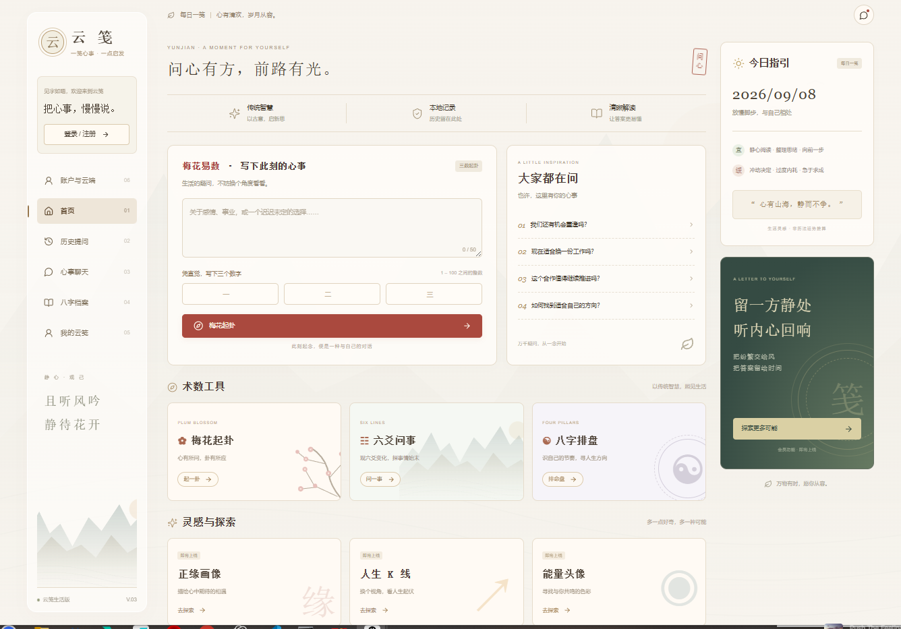

# 云笺 · 问心有方

## 首页预览



## V0.4 账户与数据库

当前工作目录：`E:\yunjian`。新增 `/account` 邮箱登录、注册、邮箱验证回调、忘记密码、修改密码、退出登录，以及用户主动确认的云端资料保存和恢复。

启用步骤见 `supabase/SETUP.md`；建表脚本是 `supabase/migrations/001_accounts.sql`。需在你自己的 Supabase 项目执行脚本，再配置 `SUPABASE_URL`、`SUPABASE_PUBLISHABLE_KEY`、`SITE_URL`。云端项目和真实邮件尚未配置，页面不会创建假账户。

当前预览为 `http://localhost:3001/account`。若在3001端口测试真实邮件回调，SITE_URL与Supabase的Redirect URLs也要使用3001；默认 `npm run dev` 使用3000。

已通过生产构建、账户接口模拟测试、浏览器注册/登录/重置/云端操作模拟测试，以及本地PostgreSQL兼容引擎的RLS隔离、匿名拒绝和版本冲突测试。真实邮件与线上数据库仍需配置后联调。

迁移后此目录的 `.git` 元数据不完整，目前不能直接 `git push`。源码不受影响，可将完整代码上传到原GitHub仓库；不要上传 `.env.local`、`.work`、`.next`、node_modules或ZIP文件本身。也可以在有写权限的新目录克隆原仓库，再复制本项目源码进入该仓库提交。

Next.js、TypeScript、Tailwind CSS 国风网站。SVG与CSS装饰为原创，无外部图片或字体请求。当前为 V0.3，新增心事聊天、八字档案与排盘、个人设置和数据备份。

## V0.3 新功能

- `/chat`：复用已有 LLM 配置的多轮聊天。每次发送最近6轮及当前消息；最多保留30段对话，每段50轮。支持失败重试、TXT导出与删除。消息保存失败时不发起付费请求。当前本地仅验证模拟模型和未配置提示，真实模型需要使用线上已有配置验证。
- `/profiles`：新增、编辑、删除最多50份档案；公历出生日期与北京时间输入，四柱、天干十神、纳音和五行字数展示。出生资料不发送给模型。
- 排盘使用MIT许可的lunar-typescript：年柱立春换年、月柱按节气、sect=2零点换日；未处理真太阳时、历史夏令时和出生地经度，不支持大运、流年、喜用神。五行字数不代表旺衰。请填写真实时间，默认12:00仅为输入占位值。
- `/settings`：本机昵称设置、统计、完整JSON导出/恢复和两步确认清空。恢复前验证数据并明确提示替换现有记录；最多8MB。备份包含个人资料，请妥善保管。无登录、云同步和支付。
- `/history` 新增关键词搜索。原有三数起卦和旧版演示记录兼容。

验证：`node tests/features.cjs` 覆盖已知四柱案例、闰日、日期边界、零点换日、备份校验/回滚和聊天接口模拟。浏览器另验证档案增改删、聊天持久化、完整备份恢复和375px手机布局。

## 更新已部署的网站

本次改动保存在本地，尚未提交到你线上仓库。解压 `yunjian-v03.zip`，将里面的 `app`、`lib`、`public`、`tests` 和根目录配置文件上传到原GitHub仓库的对应位置，提交 Commit changes。不要把ZIP本身上传，也不要额外套一层文件夹。务必一起更新package.json与package-lock.json（新增历法库）。

保留Vercel已有的LLM_BASE_URL、LLM_MODEL、LLM_API_KEY，不需要新增变量。提交到已连接的生产分支后查看Vercel构建，Ready后用原网址验证。网页恢复备份仅修改该浏览器本地数据，不会改动服务端。

## 本地运行

需要 Node.js 20.9 或更新版本，在项目目录执行：

```sh
npm ci
npm run dev
```

打开 http://localhost:3000 。生产模式执行 `npm run build` 和 `npm start`。`npm run typecheck` 检查类型；`node tests/reading.cjs` 检查384种卦象/动爻组合及模拟API错误，不调用付费模型。

## 配置大模型

复制 `.env.example` 为 `.env.local`，填写 LLM_BASE_URL、LLM_MODEL、LLM_API_KEY。基础地址不包含 `/chat/completions`，必须为HTTPS。配置后重启本地服务。密钥仅在服务端读取，不要加NEXT_PUBLIC_前缀或提交真实密钥。

例如 DeepSeek（模型名以实时文档及账户权限为准）：

```dotenv
LLM_BASE_URL=https://api.deepseek.com
LLM_MODEL=deepseek-v4-flash
LLM_API_KEY=在本地填写你的真实密钥
```

官方参考：https://api-docs.deepseek.com/ 。其他兼容Chat Completions API的服务可修改基础地址和模型名。当前发送model、messages、max_tokens、stream:false，读取choices[0].message.content；不同服务仍需实际联调。

首页起卦后点击“生成 AI 解读”，问题和卦象才发送至配置的服务。未配置模型时仍能计算卦象，并显示清晰的配置提示。AI失败可重试，成功后存入本地历史，刷新和打开历史不会重复调用。

## 起卦方法

新记录固定使用 `three-number-v1`：第一数除8取上卦，第二数除8取下卦（余0为8），第三数除6取动爻（余0为6）。输入为三个1–100整数，不混入时辰。八卦顺序为乾兑离震巽坎艮坤。爻位自下而上，变卦翻转动爻；互卦下卦取第2/3/4爻，上卦取第3/4/5爻。动爻所在经卦为用，另一经卦为体。

这是本产品选择的三数法，不声称是唯一流派或能证实未来事件。程序负责计算，模型负责象征性文化解读。5/7/1对应风山渐、初爻动、互卦火水未济、变卦风火家人。旧版无method标记的记录保留原“演示数据”，不会改写旧记录。

## 页面与存储

- `/`：响应式首页、热门问题填入、50字问题及三个整数校验。
- `/result?id=...`：本卦、互卦、变卦、规则说明、AI解读及重新提问。
- `/history`：最多100条浏览器本地记录，支持查看及逐条删除。
- 未完成入口显示“即将上线”。今日指引是固定生活灵感，不是农历或每日运势计算。

历史使用localStorage，不可用时尝试sessionStorage保存当前记录；两者均禁用时提示错误。清理浏览器数据或更换设备后无法恢复，结果网址不可跨设备分享。解读按React文本渲染，不执行HTML。没有登录、云数据库、支付或后台。

## 服务端接口

POST `/api/interpret` 校验问题、数字和method，重新计算卦象，不信任客户端排盘。包含45秒超时、2KB请求体限制、浏览器同源校验、单实例每IP每分钟5次短时节流。错误信息不返回密钥或上游内部响应。

此限流不是账户认证或跨实例配额。公开运营前应接入平台WAF/共享限流、账户配额，并在模型平台设置消费上限。当前没有用户账户体系。

## Vercel 上线

1. 将项目提交到GitHub，不提交.env.local、node_modules、.next。
2. Vercel → Add New → Project，导入仓库，框架选择Next.js。
3. 仓库根目录就是本项目时使用默认Root Directory；提交整个外层工作区时选择`outputs/yunjian`。
4. 构建命令`npm run build`，输出目录默认，Node.js至少20.9。
5. 在项目环境变量填入模型配置，选好Production/Preview环境后部署。修改变量后重新部署。
6. 检查生产部署访问保护，用无痕窗口、手机测试起卦、真实模型解读、刷新和历史删除。
7. Settings → Domains可绑定域名。推送生产分支后自动重新部署。

参考：https://vercel.com/docs/git/vercel-for-github 。用户已部署旧版；本轮更新尚未发布到线上。真实模型调用需使用有效凭据验证。

## 代码

`app/studio.tsx`为页面和历史；`app/reading-result.tsx`为真实起卦和AI交互；`lib/divination.ts`为计算；`app/api/interpret/route.ts`为模型接口；`app/globals.css`为主题及响应式样式。
